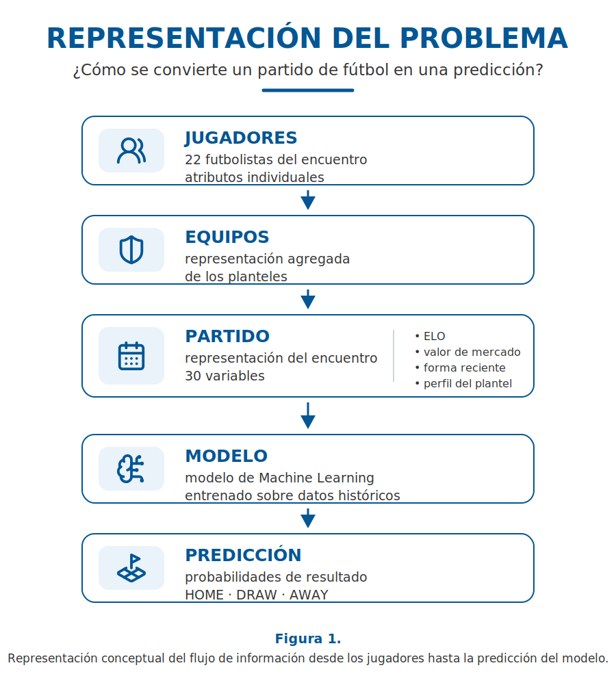
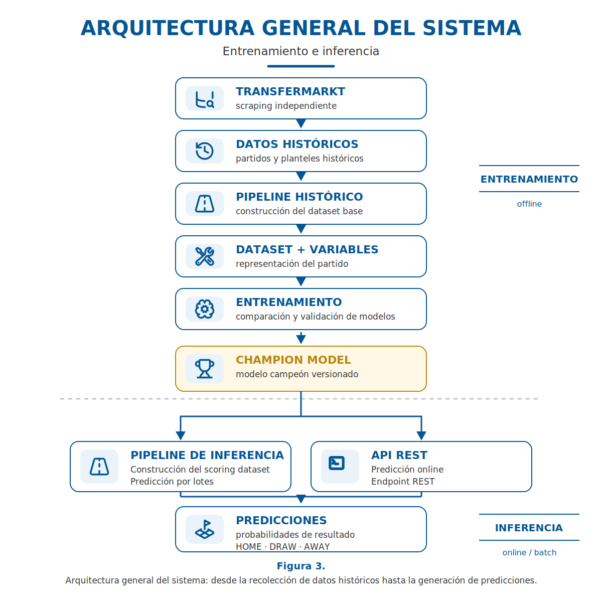

# ⚽ Football Match Prediction System

Sistema de Machine Learning para predecir resultados de partidos de fútbol utilizando datos tabulares construidos a partir de información histórica de equipos y jugadores.

El proyecto fue desarrollado con foco en buenas prácticas de **Machine Learning en producción**, incluyendo construcción del dataset, ingeniería de variables, selección de características, benchmark de modelos, exportación de un Champion Model, pipelines reproducibles, API de inferencia, Docker y documentación automática.

---

## Estado del proyecto

| Componente | Estado |
|---|:---:|
| Dataset | ✅ |
| EDA | ✅ |
| Feature Engineering | ✅ |
| Feature Selection | ✅ |
| Model Benchmark | ✅ |
| Champion Model | ✅ |
| Historical Pipeline | ✅ |
| Inference Pipeline | ✅ |
| FastAPI | ✅ |
| Docker | ✅ |
| Documentación automática | ✅ |

---

## Objetivo

Predecir el resultado de un partido de fútbol como un problema de clasificación multiclase:

- `HOME`
- `DRAW`
- `AWAY`

El modelo utiliza exclusivamente información disponible antes del inicio del partido, evitando **data leakage** y preservando la consistencia entre entrenamiento e inferencia.

---

## Representación del problema

<p align="center">
  
</p>

---

## Arquitectura general

El sistema se organiza en torno a dos flujos principales: un pipeline histórico para construir y entrenar el modelo, y un pipeline de inferencia para generar predicciones sobre nuevos partidos.

<p align="center">
  
</p>

---

## Estructura del proyecto

```text
data/
docs/
models/
notebooks/
src/

Dockerfile
requirements.txt
README.md