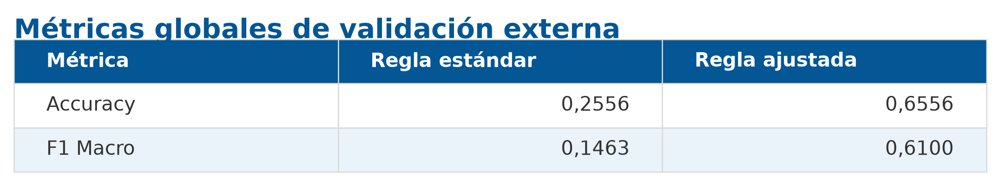
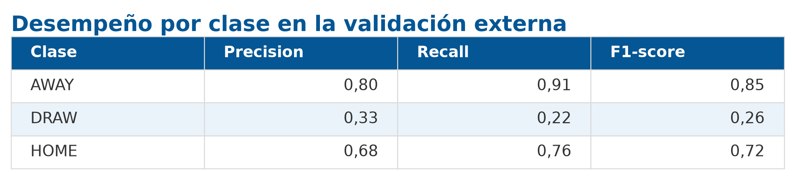
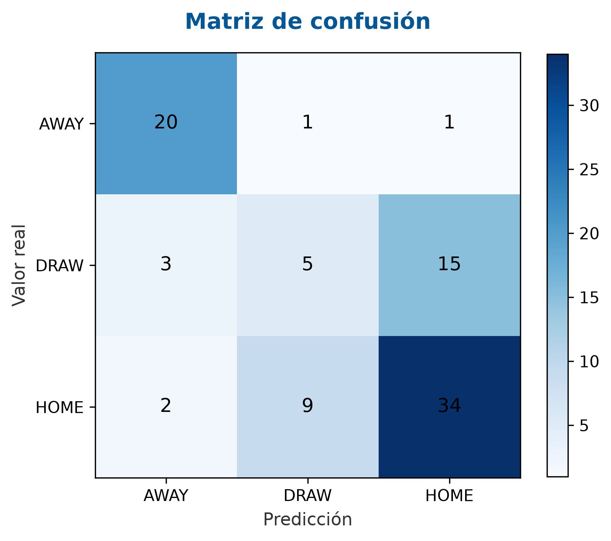

# Anexo A – Validación externa del modelo campeón sobre la Copa Mundial de la FIFA 2026

## 1. Introducción

Una vez finalizado el desarrollo del sistema de predicción y seleccionado el modelo campeón para producción, se realizó una validación externa utilizando partidos correspondientes a la Copa Mundial de la FIFA 2026.

El propósito de esta evaluación fue analizar la capacidad de generalización del modelo frente a datos completamente nuevos, distintos de aquellos utilizados durante las etapas de entrenamiento, validación y selección del algoritmo. A diferencia de la evaluación tradicional basada en particiones del conjunto histórico, esta instancia reproduce un escenario de producción en el que el modelo debe realizar predicciones sobre encuentros futuros empleando únicamente la información disponible antes del inicio de cada partido.

Para ello se desarrolló un pipeline específico que permitió construir automáticamente todas las variables requeridas por el modelo campeón a partir de información actualizada de las selecciones participantes, incluyendo rankings FIFA, convocatorias, características agregadas de los planteles y demás variables derivadas utilizadas durante el entrenamiento.

Finalmente, las predicciones obtenidas fueron comparadas con los resultados oficiales de los partidos disputados durante el torneo, permitiendo cuantificar el desempeño del modelo en un contexto completamente independiente del conjunto de entrenamiento y evaluar su comportamiento bajo condiciones reales de utilización.

## 2. Objetivo de la validación

La validación externa tuvo como objetivo evaluar el desempeño del modelo campeón sobre un conjunto de datos completamente independiente del utilizado durante su desarrollo.

Mientras que las métricas presentadas en el informe principal fueron obtenidas a partir del conjunto histórico de entrenamiento mediante particiones de entrenamiento y prueba, la evaluación realizada en este anexo utiliza encuentros correspondientes a la Copa Mundial de la FIFA 2026, competición que no formó parte del proceso de construcción del modelo.

Esta metodología permite analizar la capacidad de generalización del sistema frente a nuevos escenarios, verificando si las relaciones aprendidas durante el entrenamiento continúan siendo válidas cuando el modelo es aplicado sobre datos reales y previamente desconocidos.

Asimismo, esta evaluación reproduce un escenario cercano al de producción, ya que todas las predicciones fueron realizadas utilizando exclusivamente información disponible antes del inicio de cada encuentro. En consecuencia, el experimento constituye una validación *out-of-sample*, donde ni los partidos evaluados ni la información utilizada para generar sus variables habían sido empleados durante el entrenamiento del modelo.

Los objetivos específicos de esta validación fueron:

* Verificar la capacidad de generalización del modelo campeón sobre una competición distinta de las utilizadas para el entrenamiento.
* Evaluar el funcionamiento del pipeline completo de inferencia desarrollado para producción.
* Analizar el comportamiento del modelo frente a datos reales obtenidos automáticamente mediante los procesos de scraping y construcción de variables.
* Identificar posibles limitaciones del modelo, particularmente en la predicción de empates, y evaluar estrategias de mejora basadas en las probabilidades estimadas por el clasificador.
## 2. Objetivo de la validación

La validación externa tuvo como objetivo evaluar el desempeño del modelo campeón sobre un conjunto de datos completamente independiente del utilizado durante su desarrollo.

Mientras que las métricas presentadas en el informe principal fueron obtenidas a partir del conjunto histórico de entrenamiento mediante particiones de entrenamiento y prueba, la evaluación realizada en este anexo utiliza encuentros correspondientes a la Copa Mundial de la FIFA 2026, competición que no formó parte del proceso de construcción del modelo.

Esta metodología permite analizar la capacidad de generalización del sistema frente a nuevos escenarios, verificando si las relaciones aprendidas durante el entrenamiento continúan siendo válidas cuando el modelo es aplicado sobre datos reales y previamente desconocidos.

Asimismo, esta evaluación reproduce un escenario cercano al de producción, ya que todas las predicciones fueron realizadas utilizando exclusivamente información disponible antes del inicio de cada encuentro. En consecuencia, el experimento constituye una validación *out-of-sample*, donde ni los partidos evaluados ni la información utilizada para generar sus variables habían sido empleados durante el entrenamiento del modelo.

Los objetivos específicos de esta validación fueron:

* Verificar la capacidad de generalización del modelo campeón sobre una competición distinta de las utilizadas para el entrenamiento.
* Evaluar el funcionamiento del pipeline completo de inferencia desarrollado para producción.
* Analizar el comportamiento del modelo frente a datos reales obtenidos automáticamente mediante los procesos de scraping y construcción de variables.
* Identificar posibles limitaciones del modelo, particularmente en la predicción de empates, y evaluar estrategias de mejora basadas en las probabilidades estimadas por el clasificador.

## 3. Pipeline de evaluación

Con el objetivo de reproducir un escenario de producción lo más realista posible, se desarrolló un pipeline específico para la Copa Mundial de la FIFA 2026. Este pipeline permitió construir automáticamente todas las variables requeridas por el modelo campeón utilizando únicamente información disponible antes de la disputa de cada encuentro.

El proceso completo fue diseñado para mantener la misma lógica empleada durante la etapa de entrenamiento, garantizando la consistencia entre las variables utilizadas para ajustar el modelo y aquellas empleadas durante la inferencia.

El pipeline de evaluación estuvo compuesto por cuatro etapas principales:

1. Obtención de la información previa de cada partido.
2. Construcción del snapshot de las selecciones nacionales.
3. Generación del conjunto de variables de entrada.
4. Ejecución de las predicciones mediante el modelo campeón.

Cada una de estas etapas se describe a continuación.

### 3.1 Obtención de la información previa de cada partido

Como punto de partida se recopiló el calendario oficial de partidos correspondiente a la Copa Mundial de la FIFA 2026.

Para cada encuentro se identificaron las selecciones participantes y la fecha de disputa, información utilizada posteriormente para reconstruir el estado de ambos equipos inmediatamente antes del inicio del partido.

Esta información constituye la base temporal sobre la cual se generaron todas las variables utilizadas por el modelo, evitando el uso de datos posteriores al encuentro y previniendo cualquier forma de filtración de información (*data leakage*).

### 3.2 Construcción del snapshot de las selecciones

Una vez identificado el calendario de partidos, se construyó un *snapshot* para cada selección nacional participante. El objetivo de este proceso fue representar el estado de cada equipo inmediatamente antes del comienzo de cada encuentro, utilizando exclusivamente información disponible hasta ese momento.

Durante la etapa de entrenamiento, las variables asociadas a cada equipo fueron construidas utilizando los once futbolistas que efectivamente disputaron cada partido, información que solo es conocida cuando el encuentro ya ha finalizado. Sin embargo, en un escenario de inferencia dicha información no se encuentra disponible al momento de realizar la predicción.

Por este motivo, para la validación sobre la Copa Mundial de la FIFA 2026 las características de cada selección fueron construidas a partir de los **26 jugadores convocados** para el torneo. A partir de esta información se calcularon las variables agregadas de cada equipo siguiendo la misma metodología utilizada durante el entrenamiento.

Además de la información correspondiente a los planteles, el snapshot incorporó el ranking FIFA previo a cada partido. Esta variable se utilizó como una aproximación objetiva a la fortaleza relativa de las selecciones nacionales, ya que resume el rendimiento internacional acumulado de cada equipo y proporciona una medida comparable entre países. A partir de este ranking se calcularon las variables de fortaleza relativa utilizadas posteriormente por el modelo para representar el equilibrio competitivo entre ambos equipos antes del inicio del encuentro.

Esta adaptación metodológica permitió reproducir de manera más fiel un escenario de producción, utilizando únicamente información que podría conocerse antes del inicio de cada encuentro y evitando el uso de datos que, en una aplicación real, aún no estarían disponibles.

### 3.3 Generación de variables

Una vez construido el *snapshot* de cada selección, se procedió a generar el conjunto de variables de entrada requerido por el modelo campeón.

Para ello se reutilizó el mismo proceso de ingeniería de variables desarrollado durante la etapa de entrenamiento, garantizando que las características calculadas durante la inferencia fueran consistentes con aquellas empleadas para ajustar el modelo. De esta manera, se evitó cualquier diferencia entre los datos utilizados durante el entrenamiento y los utilizados posteriormente en producción.

El proceso incluyó la generación de variables descriptivas de los planteles, indicadores de fortaleza relativa entre las selecciones y variables derivadas a partir de las diferencias observadas entre ambos equipos. En particular, se calcularon las mismas variables asociadas al ranking FIFA, al valor de mercado de los planteles, a la experiencia internacional de los jugadores y a las características agregadas de cada selección.

Finalmente, las variables generadas fueron organizadas utilizando exactamente el mismo conjunto de características (*feature set*) definido para el modelo campeón, asegurando la compatibilidad con el pipeline de inferencia y permitiendo realizar las predicciones sin necesidad de modificaciones adicionales.

### 3.4 Inferencia con el modelo campeón

Una vez generado el conjunto de variables de entrada, se ejecutó el proceso de inferencia utilizando el modelo campeón exportado durante la etapa de desarrollo.

En esta instancia no se realizó ningún reentrenamiento del modelo ni se modificaron sus hiperparámetros. Se utilizó exactamente la misma versión del modelo seleccionada como campeón, junto con el mismo conjunto de variables empleado durante su entrenamiento.

Para cada partido, el modelo estimó las probabilidades asociadas a las tres clases posibles (victoria local, empate y victoria visitante), así como la predicción final correspondiente.

Las predicciones obtenidas fueron almacenadas junto con las probabilidades estimadas para cada clase, permitiendo posteriormente evaluar el desempeño del modelo frente a los resultados reales de los encuentros y analizar distintas estrategias de decisión basadas en dichas probabilidades.

## 4. Ajuste de la regla de decisión

Durante la evaluación inicial se observó que, si bien el modelo generaba probabilidades para las tres clases posibles, la regla de decisión estándar basada en seleccionar la clase de mayor probabilidad producía una marcada sobreestimación de los empates. Como consecuencia, una gran proporción de los encuentros era clasificada como **DRAW**, lo que afectaba significativamente el desempeño global del sistema.

Este comportamiento difiere del observado durante la etapa de entrenamiento y podría estar asociado a las particularidades del escenario de inferencia utilizado en esta validación, donde las características de cada selección fueron construidas a partir de los jugadores convocados y no de las alineaciones efectivamente utilizadas en cada partido.

Con el objetivo de mejorar la calidad de las predicciones, se implementó una regla de decisión alternativa basada en un umbral mínimo para la probabilidad de empate.

En lugar de seleccionar siempre la clase con mayor probabilidad estimada, la predicción final se obtuvo aplicando el siguiente criterio:

* Si la probabilidad estimada para la clase **DRAW** supera un determinado umbral, el partido se clasifica como empate.
* En caso contrario, la predicción corresponde a la clase con mayor probabilidad entre **HOME** y **AWAY**.

Es importante destacar que esta estrategia no modifica el modelo entrenado ni las probabilidades generadas por el clasificador. Únicamente altera la regla utilizada para convertir dichas probabilidades en una predicción final, constituyendo un procedimiento de calibración posterior (*post-processing*) orientado a mejorar el equilibrio entre las clases.

## 5. Resultados obtenidos

### 5.1 Métricas globales

La evaluación se realizó sobre un conjunto de **82 partidos** (y luego 90) correspondientes a la Copa Mundial de la FIFA 2026.

Inicialmente se evaluó el desempeño del modelo utilizando la regla de decisión estándar, basada en seleccionar la clase con mayor probabilidad estimada. Posteriormente, se aplicó la regla de decisión ajustada presentada en la sección anterior, utilizando el umbral que maximizó la métrica F1 Macro sobre el conjunto de evaluación.

La Tabla 1 resume los resultados obtenidos en ambos escenarios.

Los resultados muestran una mejora sustancial del desempeño una vez aplicada la nueva regla de decisión. En particular, la exactitud global aumentó aproximadamente 40 puntos porcentuales, mientras que el F1 Macro se incrementó más de cuatro veces respecto de la evaluación inicial.

Estos resultados indican que la información probabilística generada por el modelo resultó adecuada, pero que la regla de decisión estándar no era la más apropiada para este escenario de inferencia. La estrategia de *post-processing* permitió aprovechar mejor dichas probabilidades sin modificar el modelo entrenado.

### 5.2 Desempeño por clase

La Tabla 2 presenta el reporte de clasificación obtenido luego de aplicar la regla de decisión ajustada.

Los resultados muestran un comportamiento heterogéneo entre las tres clases. El modelo alcanzó su mejor desempeño en la predicción de victorias visitantes (**AWAY**), obteniendo elevados valores de precisión, sensibilidad (*recall*) y F1-score.

La clase **HOME** también presentó un desempeño satisfactorio, con valores equilibrados de precisión y sensibilidad, reflejando una adecuada capacidad del modelo para identificar victorias del equipo local.

Por el contrario, los empates (**DRAW**) continúan representando la clase de mayor dificultad. Si bien la estrategia de ajuste de la regla de decisión permitió mejorar considerablemente el desempeño global del sistema, la identificación de este tipo de encuentros sigue siendo limitada, obteniendo los valores más bajos de precisión, sensibilidad y F1-score.

Este comportamiento resulta consistente con la naturaleza de los partidos de fútbol, donde los empates suelen depender de factores difíciles de capturar mediante variables previas al encuentro. En consecuencia, su predicción continúa representando uno de los principales desafíos para modelos de clasificación aplicados a resultados deportivos.

### 5.3 Matriz de confusión

La Figura 1 presenta la matriz de confusión obtenida luego de aplicar la regla de decisión ajustada.

La matriz permite visualizar la distribución de las predicciones correctas e incorrectas para cada una de las tres clases consideradas por el modelo.

En términos generales, se observa una buena capacidad para identificar victorias locales (**HOME**) y visitantes (**AWAY**), reflejada en la elevada concentración de observaciones sobre la diagonal principal para ambas categorías.

Por el contrario, la clase **DRAW** continúa presentando la mayor cantidad de errores de clasificación. En la mayoría de estos casos, los encuentros que finalizaron en empate fueron clasificados como victorias locales o visitantes, evidenciando la dificultad del modelo para distinguir este tipo de resultados a partir de la información disponible antes del inicio del partido.

En conjunto, la matriz de confusión confirma las conclusiones obtenidas a partir de las métricas presentadas anteriormente: el modelo presenta un desempeño sólido para la predicción de victorias, mientras que la identificación de empates continúa siendo el principal desafío del sistema.

## 6. Análisis de resultados

La validación realizada sobre la Copa Mundial de la FIFA 2026 permitió evaluar el comportamiento del modelo campeón en un escenario significativamente diferente al utilizado durante su entrenamiento.

A diferencia del conjunto histórico empleado para desarrollar el modelo, compuesto principalmente por partidos correspondientes a las principales ligas europeas y competiciones internacionales de clubes; esta evaluación se realizó sobre partidos entre selecciones nacionales. Además, las variables descriptivas de cada equipo fueron construidas a partir de los jugadores convocados al torneo, en lugar de utilizar las alineaciones efectivamente empleadas en cada encuentro. Estas diferencias representan un escenario de inferencia más cercano a una aplicación real, donde la información disponible antes del inicio del partido es necesariamente limitada.

En este contexto, el modelo mostró inicialmente una marcada tendencia a sobreestimar la probabilidad de empate. Si bien la causa exacta de este comportamiento no fue objeto de análisis específico, una posible explicación es que las diferencias metodológicas entre el conjunto de entrenamiento y el escenario de inferencia modificaron la distribución de algunas de las variables utilizadas por el clasificador, afectando la calibración de las probabilidades estimadas.

La incorporación de una regla de decisión basada en un umbral para la probabilidad de empate permitió corregir este comportamiento sin necesidad de reentrenar el modelo. Este resultado pone de manifiesto la importancia de considerar estrategias de calibración y *post-processing* cuando un modelo es trasladado desde un entorno de desarrollo hacia un escenario de producción.

Finalmente, si bien la identificación de empates continúa siendo el principal desafío del sistema, los resultados obtenidos muestran que el modelo mantiene una adecuada capacidad de generalización frente a datos completamente nuevos, respaldando la robustez del pipeline de inferencia desarrollado para este trabajo.

## 7. Conclusiones

La validación externa realizada sobre la Copa Mundial de la FIFA 2026 permitió evaluar el desempeño del modelo campeón en un escenario completamente independiente del conjunto de datos utilizado durante su desarrollo.

Los resultados obtenidos demuestran que el modelo es capaz de generar predicciones consistentes sobre datos previamente no observados y que el pipeline de inferencia desarrollado reproduce de manera satisfactoria las condiciones esperadas en un entorno de producción.

Asimismo, la evaluación puso de manifiesto la importancia de complementar el modelo con estrategias de calibración de la regla de decisión. La incorporación de un umbral para la probabilidad de empate permitió mejorar significativamente las métricas de desempeño sin modificar el modelo entrenado, evidenciando el valor del *post-processing* como herramienta para adaptar un clasificador a nuevos escenarios de aplicación.

En conjunto, los resultados obtenidos respaldan la capacidad de generalización del modelo campeón y constituyen una validación adicional del sistema desarrollado, demostrando que tanto el modelo como el pipeline de inferencia mantienen un desempeño satisfactorio cuando son aplicados sobre datos completamente nuevos y bajo condiciones cercanas a un escenario real de producción.
